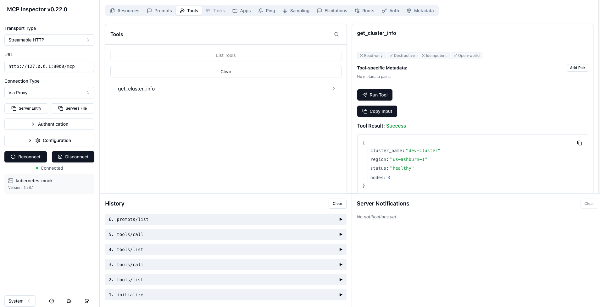

# Day 2

## Goal

Build first FastMCP Server.

---

## Python Topics

- Data Types

---

## MCP

### Server

```python
mcp = FastMCP(...)
```

## Tool

@mcp.tool()
def get_cluster_info():

---

## Run

python3 mcp/kubernetes_server.py

___

## Output

```bash
INFO:     Started server process [81318]
INFO:     Waiting for application startup.
StreamableHTTP session manager started
INFO:     Application startup complete.
INFO:     Uvicorn running on http://127.0.0.1:8000 (Press CTRL+C to quit)
```

---

## MCP Inspector

```bash
npx @modelcontextprotocol/inspector
```

### Connected

### Tool List

### Tool Call



---

## Lessons Learned

FastMCP automatically discovers tools.
Tool docstrings become descriptions.
Streamable HTTP transport uses Uvicorn.

---