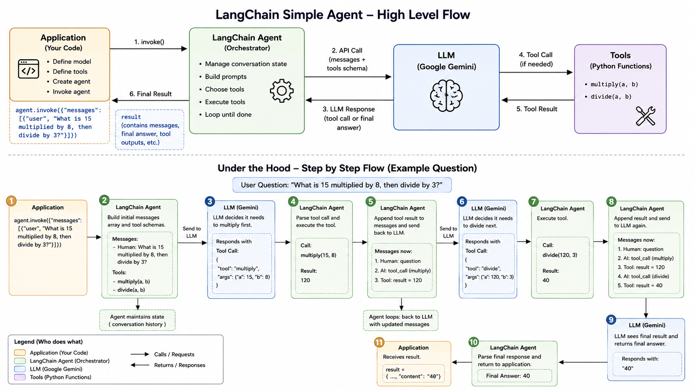

# Day 3

## Goal

- Understand the LangChain agent workflow.
- Learn how an LLM can choose and use tools.
- Visualize the agent loop from user request to final answer.

---

## LangChain Workflow

1. The application defines the model and available tools, then invokes the agent.
2. LangChain builds the messages and tool schemas and sends them to the LLM.
3. The LLM either returns a final answer or requests a tool call.
4. LangChain executes the requested Python tool and adds its result to the conversation state.
5. LangChain sends the updated messages back to the LLM and repeats the loop until a final answer is returned.

---

## Diagram

---

## What I Learned

- LangChain acts as the orchestrator between the application, LLM, and tools.
- The LLM decides when a tool is needed; LangChain handles executing the tool.
- Tool results are added to the conversation history so the LLM can use them in its next response.
- An agent may call multiple tools before it can produce a final answer.

---
